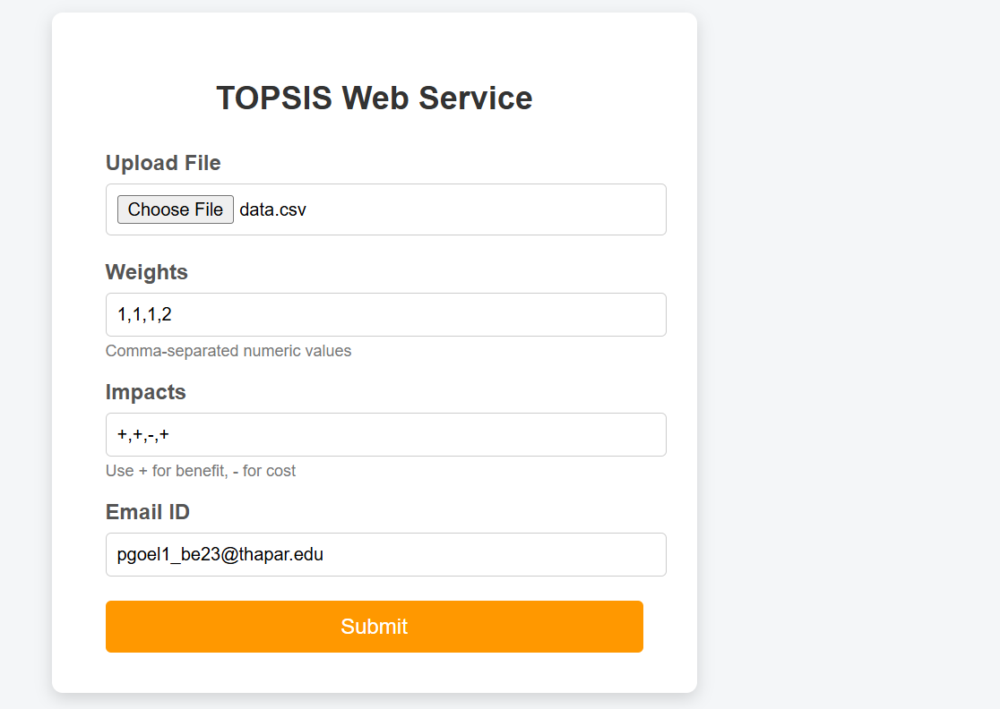

# TOPSIS Decision Support System

This repository contains a complete implementation of the TOPSIS (Technique for Order Preference by Similarity to Ideal Solution) method. The project was developed as part of an academic assignment and includes a command-line tool, a PyPI package, and a web-based service.

## Project Overview

TOPSIS is a multi-criteria decision-making technique used to rank alternatives based on their relative distance from an ideal best and an ideal worst solution.

This project provides:
- A command-line interface (CLI) for TOPSIS
- A Python package published on PyPI
- A Flask-based web service with email delivery

## Repository Structure

topsis/
├── cli/
│   └── Topsis-Pranshu-102313009/
│       ├── topsis_pranshu/
│       ├── setup.py
│       ├── README.md
│       └── LICENSE
├── web/
│   ├── app.py
│   ├── topsis_core.py
│   ├── templates/
│   │   └── index.html
│   └── uploads/
├── screenshots/
│   ├── form_screen.png
│   └── result_screen.png
└── .gitignore

## Part I – Command Line Interface

The CLI tool computes TOPSIS scores and ranks alternatives using a CSV or Excel file.

Usage:
python topsis.py <InputFile> <Weights> <Impacts> <OutputFile>

Example:
python topsis.py data.csv "1,1,1,2" "+,+,-,+" result.csv

## Part II – PyPI Package

Installation:
pip install topsis-pranshu-102313009

Usage:
topsis data.csv "1,1,1,2" "+,+,-,+" output.csv

## Part III – Web Service

A Flask-based web application provides a graphical interface for executing TOPSIS.

Workflow:
1. User uploads a CSV or XLSX file
2. User enters weights, impacts, and email ID
3. Inputs are validated on the server
4. TOPSIS scores and ranks are computed
5. Result file is sent to the user via email

## Web Interface

Input Form  

Result Received  

## Technologies Used

- Python
- Pandas
- NumPy
- Flask
- HTML & CSS
- SMTP (Email Service)

## Author

Pranshu Goel  
Roll Number: 102313009

## Notes

- Build artifacts and temporary files are excluded using .gitignore
- Email delivery is implemented using secure Gmail App Passwords
- The project maintains a clear separation between CLI, package, and web service components
